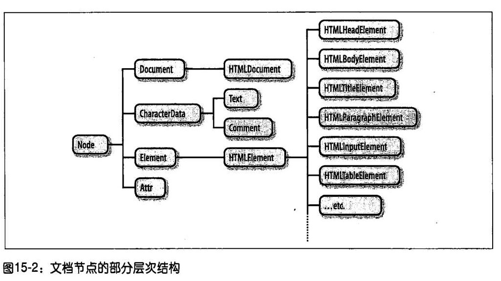

客户端JavaScript是静态的文档变得交互式的web应用。JavaScript是web页面应用内容的核心，脚本化web文档是它的核心目标，因此本章的主题就是阐述它是如何做到的。本章会分为几个章节进行，至于分为几个章节，以每个章节的字数为标准。

每个Window对象有个document属性引用了Document对象。这个对象表示窗口的内容，它是本章的主题，Document对象是一个巨大的API中的核心对象，叫做文档对象模型（Document Object Model，DOM），代表和操作文档的内容。

我们会涉及的内容：

#### 一、如何在文档中查询或选取单独的元素。 ####
#### 二、如何将文档作为节点树来遍历，如何找到任何文档元素的祖先、兄弟和后代元素。 ####
#### 三、如何查询和设置文档元素的属性。 ####
#### 四、如何查询、设置和修改文档内容。 ####
#### 五、如何通过创建、插入和修改节点来修改文档结构。 ####
#### 六、如何与HTML表一起工作。 ####
#### 七、其他 ####
###一、DOM概览 ###
文档对象模型（DOM）是表示和操作HTML和XML文档内容的基础API。API不是不复杂但是细节很多。首先应该了解HTML或者XML文档的嵌套元素在DOM树对象中的表示。HTML文档的树状结构包含表示HTML标签或元素和表示文本字符串的节点，它也可能表示包含表示HTML注释的节点。常见的DOM文档节点树的树状图

图中的每个方框是文档的一个节点，它表示一个Node对象,对于Node对象的属性和方法，我们稍后讨论，树形的根部是Document节点，它代表整个文档。代表HTML元素的节点是Element节点，代表文本的是Text节点。Document、Element和Text是Node的子类。前两者是两个重要的DOM类，我们本章主要讨论的就只这两个家伙的属性和方法。

下面的图片展示了Node及其类型层次结构中的子类型。注意的是Document和Element类型与HTMLDocument和HTMLElement类型之间是有严格区别的。Document类型代表一个HTML或者XML文档，Element类型代表该文档中的一个元素。HTMLDocument和HTMLElement子类只是针对于HTML文档和元素。前两者我们经常使用。

至于HTMLElement内容以后再说，而上面图片中的Comment节点代表HTML或XML的注释。由于注释基本上是字符串，因此很像文档，CharacterData通常是Text和Comment的祖先。Attr节点类型代表XML或HTML属性，但几乎不用，因为和文档节点不同，Element类型定义了将属性当作“名/值”对使用的方法。DocumentFragment类在实际文档中并不存在的一种节点：代表没有常规父节点的节点。有时很有用，有时候没用。
### 二、选取文档元素 ###
JavaScript程序运行时总是在操作一个或者多个文档元素，这些程序启动时可以使用全局变量document来引用Document对象。但我们必须通过某种方式获得或者选取这些文档中的Element元素，方法有如下几种：

a、用指定的id属性；

b、指定的name属性；

c、指定的标签名字；

d、指定的CSS类；

e、匹配指定的CSS选择器。

#### 1、id选择器 ####
选择一个基于唯一id的元素，

	var section = document.getElementById("section");
for example 1:

	//通过id查找多个元素
	//函数接受任意多个的字符串参数
	//每个参数将当作元素的id传给document.getElementById()
	//返回一个对象，它把这些id映射到对应Element对象
	//如任何一个id对应的元素未定义，则抛出一个Error对象

	function getElement(ids) {
		var elements = {};                        //开始是一个空map映射对象
		for (var i = 0;i < arguments.length;i++) {//循环每个参数
			var id = arguments[i];                //参数是元素的id
			var elt = document.getElementById(id);//查找元素
			if(elt == null)                       //如果没有给出定义
				throw new Error("No element with id :" + id);//抛出异常
			elements[i] = elt;//id和元素之间映射
		}
		return elements;//对于元素映射返回id
	}
#### 2、通过name属性选取元素 ####
元素的名字并不是唯一的，可能有多个元素具有同一个名字，但是和id属性不同的是，name属性只在少数HTML元素中有效，包括表单、表单元素、`<iframe>`和``元素。

	var radiobuttons = document.getElementsByName("favorite_color");
本方法定义在HTMLDocument类中，不对XML有效。它返回的是一个NOdelist对象，是一个数组。
#### 3、用标签名字来获取元素 ####
Document对象的getElementByTagName()方法可用来获取指定类型标签名字的所有HTML或XML元素。

for example 2:

	var spans = document.getElementsByTagName("span");//得到的就是文档中所有的``元素的只读的类数组
这个方法得到的同样是个Nodelist对象。在Nodelist对象返回的元素中按照在文档中的顺序排序的，所以可以用下面的代码获取文档中的第一个`
`元素。

	var firstpara = document.getElementsByTagName('p')[0];

套用也是没有问题的：

	var firstpara = document.getElementsByTagName("p")[0];
	var firstparaSpans = firstpara.getElementsByTagName("span");
 
#### 节点列表和HTML集合 ####
通过name属性和标签名字获得元素的方法返回的都是Nodelist对象，这些都是只读的类数组对象，都有length属性，也有真正的数组一样的索引。可以对Nodelist或HTMLCollection的内容用标准的循环来迭代：

	for(var i = 0;i < document.images.length;i++) //循环所有的照片
		document.images[i].style.display = "none";//隐藏他们
不能直接在Nodelist和HTML集合上直接调用Array方法，但是可以间接使用：

	var content = Array.prototype.map.call(document.getElementsByTagName("p"),function (e) { return e.innerHTML; });
HTMLCollection对象也有额外的命令属性，也可以通过数字和字符串来索引。通常，Nodelist和HTMLCollection的实时性非常有用。但是如果在迭代一个Nodelist对象时，在文档中添加或者删除的元素，首先会需要对Nodelist对象生成一个静态的副本。

	var snapshot = Array.prototype.slice.call(nodelist,0);
#### 4、通过CSS类获取元素 ####
class属性与CSS样式通常一起使用，对某组内的所有元素应用同样的样式，HTML定义了getElementsByClassName()方法，它是基于其class属性值中的标识符选取成组的文档元素。它接受的是一个字符串，多个字符串自建用空格隔开。返回的值是Nodelist对象，包含文档或元素所有匹配的后代节点。

	//查找其class属性值中包含“warning”的所有元素
	var wranings = document.getElementsByClassName("warning");
	
	//查找以“log”命名并且有“error”和“fatal”类的元素的所有后代
	var log = document.getElementById("log");
	var fatal = log.getElementsByClassName("fatal error");	
注意：本方法适用于高于IE8的版本，低于此版本的用querySelectorAll()实现。
#### 5、用CSS选择器获取元素 ####
这里先说说CSS的选择器：
	
	#nav       //id="nav"的元素
	div       //所有
元素
	.warning  //所有在class属性中包含这个名称的元素
	p[lang="fr"] //所有使用法语的段落，如：

	*[name="x"]  //所有包含name="x"的属性
组合使用：

	span.fatal.error//其class中包含fatal和error的所有的span元素
	span[lang="fr"].warning //所有使用法语的且其class类名称为warning的span元素
	#log span #log>span body>h1:first-child div,#log

以上就是CSS的选择器的介绍，这个选择器搭配着谁来用呢，就是querySelectorAll()或querySelector()来使用，这是一个强大的方法，也是一个终极的选取元素的方法。这两者接受的就是个CSS选择器的字符串参数，返回的则是个Nodelist对象，不过不同于前面介绍的获取方法的是，此方法包含在调用时时刻选择器所匹配的元素，并不更新后续文档的变化，这个在jQuery中有所应用。
#### 6、document.all[] ####
已经被弃用，不过仍然能见到：

	document.all[0];//文档中的第一个元素
	document.all["navbar"];/id或name为navbar的元素
	document.all.navbar;//同上
	document.all.tags("div");//文档中所有的div元素
	document.all.tags("p")[0];//文档中的第一个p元素

### 三、文档结构与遍历 ###
有时候我们找到了某个元素，需要找到元素结构上与之相关的部分，包括该元素的父亲、兄弟和子女。从概念上看做是一个节点对象树。节点类型定义了遍历该树所需要的属性。

#### 1、作为节点树的文档 ####

我们知道Document对象、它的Element对象和文档中表示的Text对象都是Node对象。Node定义了一些重要的属性：

parentNode

该节点的父节点，或者针对类似Document对象应该是null，因为它没有父节点

childNodes

只读的类数组对象（Node list对象），它是该节点的子节点的实时表示

firstChild、lastChild

该节点的子节点中的第一个和最后一个，如果该节点没有子节点则为null

nextSibling、previousSibling

该节点的兄弟节点的前一个和后一个。具有相同的父节点。

节点的顺序反映了它们在文档中出现的顺序。这两个属性将节点之间以双向链表的形式连接起来。

nodeType

该节点的类型。9代表Document节点，1代表Element节点，3代表Text节点，8代表Comment节点，11代表DocumentFragment节点。

nodeValue

Text节点或Comment节点的文本内容

	document.childNodes[0].childNodes[1];
	document.firstChild.firstChild.nextSibling;
这里的节点说的既有Element对象的节点同样有Text的节点，接下来就说说仅仅是Element对象的文档元素。

#### 2、作为元素树的文档 ####
我们的兴趣在文档的元素上而不是它们之间的文本的时候，没有Text和Comment，只看Element对象树。

我们首先就是看到Element对象的属性children，这属性的眼里只有Element对象里的元素，虽然这家伙的存在并不是标准的，但却得到了大家的一致认可。我们还要知道的是上述的parentNode和children属性的世界里只有Element对象的元素，没有什么Text和Comment对象元素的。它们无论怎么追述，到最后仅仅会跑到Document或DocumentFragment节点。

下面就是一些只针对Element对象元素的属性：

firstElementChild、lastElementChild、nextElementSibling、previousElementSibling、childElementCount（它返回的值和children.length是一样的）

for example 4：

	//可移植的文档遍历树
	//返回元素e的第n层祖先元素，如果不存在此类祖先或祖先不是Element，
	//（例如Document或DocumentFragment），则返回null
	//如果n为0，则返回e本身。如果为1的话，则返回其父元素
	//如果为2的话，则返回其祖父元素，以此类推

	function parent (e,n) {
		if (n === undefined) n = 1;
		while(n-- && e) e = e.parentNode;
		if(!e || e.nodeType !== 1) return null;
		return e;
	}

	//返回元素e的第n个兄弟元素
	//如果n为正，则返回后续的第n个兄弟元素
	//如果n为负，则返回前面的第n个兄弟元素
	//如果n为0，则返回e本身

	function sibling(e,n) {
		while(e && n !==0) {
			if(n > 0) {
				if (e.nextElementSibling) e = e.nextElementSibling;
				else {
					for(e = e.nextSibling;e && e.nodeType !==1;e = e.nextSibling)
					}
					n--;
			}
			else {
				if (e.previousElementSibling) e = e.previousElementSibling;
				else {
					for (e = e.previousSibling;e && e.nodeType !== 1;e = e.previousSibling)
				}
				n++;
			}
		}
		return e;
	}

### 四、属性 ###
HTML元素是由一个标签和一组称为属性的名/值对组成，例如`<a>`元素定义了一个超链接，它的href属性值作为超链接的目的地址。HTML元素的属性值在代表这些元素的HTMLElement对象的属性中是可用的。DOM还定义了另外的API来获取或设置XML属性值和非标准的HTML属性。
#### 1、HTML属性作为Element的属性 ####
HTMLElement定义了通用的HTTP属性的属性，以及事件处理程序。特定的Element子类型为其定义了特定的属性。例如一张图片的URL，可以使用表示``元素的HTMLElement对象的src属性。

	var image = document.getElementById("myimage");
	var imgurl = image.src;
	image.id === "myimage";
同样

	var f = document.forms[0];//文档中的第一个<form>
	f.action = "http://www.example.com/submit.php";//设置提交的URL
	f.method = "POST";//HTTP请求类型
#### 2、获取和设置非标准的HTML属性 ####
Element类型定义了getAttribute()和setAttribute()方法来查询和设置非标准的HTML属性，也可以用来查询和设置XML文档中的元素的属性。

	var image = document.images[0];
	var width = parseInt(image.getAttribute("WIDTH"));
	image.setAttribute("class","thumbnail");
对于HTML属性，属性名字不区分大小写。Element类型还定义了两个相关的方法，hasAttribute()和removeAttribute(),他们用来检测命名属性是否存在和完全删除属性。使用这两个方法来读和写非标准属性的值，为此付出的代价是文档不再是合法有效的HTML。

HTML5提供了一个解决方案，文档中以“data-”为前缀的小写的属性名字都是合法的。这些”数据集属性“将不会对其元素的表现产生影响，他们还定义了一种标准的、附加额外数据的方法，并不是在文档合法性上做出让步。

HTML5还在Element对象上定义了dataset属性，该属性代指一个对象，他的各个属性对应于去掉data-属性，dataset.x应该保存data-x属性的值。连带字符的属性对应于驼峰命名法属性名：data-jquery-test属性就变成了dataset.jqueryTest属性。

for example 5：

	
	1 1 1 2 3 4 5 5 4 3 5 6 7 7 4 2 1
	
为了设计生成一条火花线，可以同如下代码提取上述dataset属性的值：
	
	var sparklines = document.getElementsByClassName("sparkline");
	for(var i = 0;i < sparkline.length;i++) {
		var dataset = sparkline[i].dataset;
		var ymin = parseFloat(dataset.ymin);
		var ymax = paseFloat(dataset.ymax);
		var data = sparklines[i].textContent.split(" ").map(parseFloat);
		drawSparkline(sparklines[i],ymin,ymax,data);
	}
### 五、元素的内容 ###
元素的内容有三种：

一是HTML字符串，如：“This is a `<i>`simple`</i>`document”

二是纯文本，没有其他节点

三是什么都有了，Text节点里面包括Text节点还有Element节点

#### 1、作为HTML的元素内容 ####
这里就用innerHTML属性作为字符串标记返回那个元素的内容，这个解析蛮快的，不过加上“+=”的话就慢多了，因为既要序列化又要解析。
#### 2、纯文本的就用textContent属性吧 ####
在除了IE浏览器的所有浏览器中都支持，IE中就用Element对象的innerText来替代着用吧。

for example 6：

	var para = document.getElementByTagName("p")[0];//文档中的第一个
元素
	var text = para.textContent;//文本是原来的
	para.textContent = "Hello World";
#### 3、作为Text节点的元素内容 ####
这个就是有子节点、父节点和兄弟节点的说到了，，下节有相关的，就在下节说。
