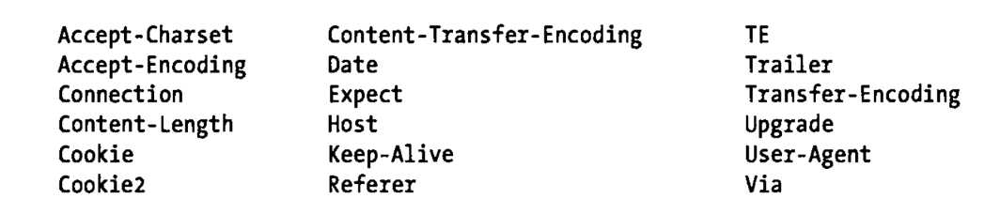

HTTP规定Web浏览器如何从Web服务器获取文档和向Web服务器提交表单内容，以及Web服务器如何响应这些请求和提交。通常，HTTP并不在脚本的控制之下，只是当用户单击链接、提交表单和输入URL时才发生控制。

用脚本控制HTTP是可行的，在设置window的location属性或者使用提交表单对象的submit()方法时，都会初始化HTTP请求，因此都会加载新页面。用HTTP可以在多框架之间使用，不过我们讨论恰恰相反，即没有导致页面的重新加载就能实现浏览器和服务器之间的通信。Ajax、就出现了。这个方式是浏览器向服务器发送请求，再有方式正好相反，是服务器向浏览器推送内容，就是Comet。

实际上用script的src属性就能设置URL并发起HTTP  GET请求，可以跨域不受同源策略的限制。通常使用script的Ajax传输协议时，服务器的响应采用JSON数据格式，当执行脚本的时，JS的解析器能自动将其解码，因此这种Ajax传输协议也叫做JSONP。

虽然通过，iframe和scrip都能实现Ajax的技术，但还是有更简单的方式。所有浏览器都支持的XMLHttpRequest对象，它定义了用脚本操纵HTTP的API。除了常用的GET请求，还有实现POST请求的能力。而且并不限制XML文档。
### 一、使用XMLHttpRequest ###
使用HTTP API的第一件事就是实例化XMLHttpRequest对象：
	
	var request = new XMLHttpRequest();
IE7之前的版本不支持非标准的XMLHttpRequest()构造函数，但支持ActiveX对象，一个HTTP请求包括4个部分：

①、HTTP请求的方法或“动作”，有GET、POST、HEAD、PUT、OPTIONS几个动作，大小写不限，但是我们通常大写，还有部分的动作被限制了
；

②、正在请求的URL；

③、一个可选的请求头集合，其中可能包括身份验证信息；

④、一个可选的请求主体。

服务器返回的HTTP响应包含3个部分：

①、一个数字和文字组成的状态码，用来显示请求成功和失败；

②、一个响应头集合；

③、响应主体。

注意：XMLHttpRequest是浏览器级别的API不是协议级别的API。浏览器需要考虑cookie、重定向、缓存和代理，但代码只需担心请求和响应。XMLHttpRequest不能用于本地文件，但可以请求本地服务器。

#### 1、指定请求 ####
创建XMLHttpRequest对象之后，发起HTTP请求的下一步是调用XMLHttpRequest对象的open()方法去指定这个请求的两个必须部分：方法和URL。

	request.open("GET","data.html");//第一个参数是HTTP  GET请求，第二个是URL内容
open()的第一个参数指定HTTP方法或动作，“GET”用于常规请求，适用于当URL完全指定请求资源，当请求对服务器没有任何副作用以及当服务器的响应式可缓存时。“POST”方法用于HTML表单，它在请求主体中包含额外数据且这些数据常存储到服务器上的数据库中。相同的URL的重复POST请求从服务器得到的响应可能不同，同时不应该缓存使用这个方法的请求。

open()的第二个参数是URL，它是请求的主体，这是相对于文档的URL，这个文档包含调用open()的脚本。如果指定绝对URL、协议、主机和端口通常必须匹配所在文档的对应内容：跨域的请求通常会报错。如果有请求头的话，请求进程的下个步骤是设置它，如POST请求需要“Content-type”头请求主体的MIME类型：

	request.setRequestHeader("Content-type","text/plain");
如果对相同的头调用setRequestHeader()多次，新值也不会取代之前指定的值，相反，HTTP请求将包含这个头的多个副本或这个头将指定多个值。这个是你能指定的头，其他的是你不能通过setRequestHeader()传递这些头：

如果请求一个受密码保护的URL，把用户名和密码作为第四个和第5个参数传递给open(),则XMLHttpRequest将设置合适的头。

使用XMLHttpRequest发起请求的最后一步是指定可选的请求主体并向服务器发送它。使用send()方法如下这样做：

	request.send(null);
GET请求绝对没有主体，所以应该传递给null或省略这个参数。POST请求通常拥有主体，同时它应该匹配使用setRequestHeader()指定的“Content-type”头。顺序是先发送请求方法和URL，然后是请求头，最后是请求主体。

	for example 1：
		function postMessage(msg) {
			var request = new XMLHttpRequest();//新请求
			request.open("POST","/log.php");//用POST向服务器发送脚本
			request.setRequestHeader("Content-type","text/plain;charset=UTF-8");//请求主体将是纯文本
			request.send(msg);//把msg作为请求主体发送
	}//我们忽略了任何响应和错误
send()方法启动请求，然后返回，当它等待服务器的响应时并不阻塞。
#### 2、取得响应 ####
一个完整的HTTP响应应该由状态码、响应头集合和响应主体组成，这些都可以通过XMLHttpRequest对象的属性和方法使用：

①、status和statusText属性以数字和文本的形式返回HTTP状态码。这些属性保存标准的HTTP值，像“200”和“OK”表示成功请求，404和“Not Found”表示URL不能匹配服务器上的任何资源。

②、使用getResponseHeader()和getAllResponseHeader()能查询响应头。XMLHttpRequest会自动处理cookie：它会从getAllResponseHeader()头返回集合中过滤掉cookie头，而如果给getResponseHeader()传递“Set-Cookie”和“Set-Cookie2”则会返回null。

③、响应主体可以从responseText属性中得到文本形式的，从responseXML属性中得到Document形式的。

XMLHttpRequest对象通常异步使用：发送请求后，send()方法立即返回，直到响应返回，前面列出的响应方法和属性才有效。为了在响应准备就绪时得到通知，必须监听XMLHttpRequest对象上的readystatechange事件（或新的XHR进度事件）。为了理解这个属性，你必须理解readyState属性。

readyState是一个整数，它指定了HTTP请求的状态，同时列出了它可能的值。第一列的符号是XMLHttpRequest构造函数定义的常量。这些常量是XMLHttpRequest规范的一部分，老的浏览器里和IE8没有它们，通常看到使用硬编码4来表示XMLHttpRequest.DONE。

XMLHttpRequest的readyState值：

	常量              值              含义

	UNSENT            0           open()尚未调用

	OPENED            1           open()已调用

	HEADERS_RECEIVED  2           接收到头信息

	LOADING           3           接收到响应主体

	DONE              4           响应完成
理论上，每次readyState属性改变都会触发readystatechange事件，实际中前两种情况下可能没有触发。当readyState值为4或服务器的响应完成时，所有的浏览器都触发这个readystatechange事件。为了监听readystatechange事件，请把事件处理函数设置为XMLHttpRequest对象的onreadystatechange属性。因为只设置一次处理程序，就没有使用addEventListener()或attachEvent()。

下面的例子定义了getText()函数来演示如让监听readystatechange事件。事件处理程序首先确保请求完成。如果这样，它会检查状态码来获取请求成功，然后他来查找“Content-type”头来验证主体是否是期望的类型。如果都满足，它会把响应主体以文本的形式发送给指定的回调函数。

	for example 1： 
	
	function getText(url,callback) {
		var request = new XMLHttpRequest();
		request.open("GET",url);
		request.onreadystatechange = function() {
			if(request.readyState === 4 && request.status === 200)
				{
				var type = request.getResponseHeader("Content-type");
				if(type.match(/^text/))
					callback(request.responseText);
			}
		};
		request.send(null);
	}
#### 同步响应 ####
由于本身的性质，异步处理HTTP响应是最好的方式。不过XMLHttpRequest对象也支持同步响应，就是把false作为open()方法的第三个参数就可以了。但是如果连接的服务器响应慢的话，用户的浏览器就会冻结。同步的代码如下：

	function getTextSync(url) {
		var request = new XMLHttpRequest();
		request.open("GET",url,false);
		request.send(null);
		if(request.status !== 200) throw new Error(request.statusText);
		var type = request.getResponseHeader("Content-Type");
		if(!type.match(/^text/))
			throw new Error("Expected textual response;got" + type);
		return request.responseText;
	}
#### 响应解码 ####
前面的实例中，我们假设服务器使用像“text/plain”、“text/html”或“text/css”这样类型的MIME类型发送文本响应，然后我们使用XNLHttpRequest对象的responseText属性得到它。

如果服务器发送XML或XHTML文档作为其响应，你能通过responseXML属性得到一个解析形式的XML文档。这个属性的值是个Document对象，可以遍历他。

如果服务器发送诸如对象或数组这样的结构化数据作为响应，应该传入JSON编码的字符串数据。当接收它时，可以把responseText属性传递给JSON.parse()。它实现指定URL的GET请求并当URL的内容准备就绪时把它们传递给指定的回调函数。但它不是一直传递文本，而是传递Document对象或使用JSON.parse()编码的对象或字符串。

for example 2：
	
	//解析HTTP响应
	function get(url,callback) {
		var request = new XMLHttpRequest();
		request.open("GET",url);
		request.onreadystatechange = function() {
			if(request.readyState === 4 && request.status === 200) {
				var type = request.getResponseHeader("Content-Type");
				if(type.indexOf("XML") !== -1 && request.responseXML)
					callback(request.resopnseXML);
				else if(type === "application/json") 
					callback(JSON.parse(request.responseText));
				else
					callback(request.requestText);
			}
		};
		request.send(null);
	}
检查响应的“Content-Type”头且专门处理“application/json”影响。你可能希望特殊的编码的另一个响应类型是“application/javascript”或“text/javascript”。你能使用XMLHttpRequest请求JS脚本，然后用全局eval()。但是这个时候不需要使用XMLHttpRequest对象，因为script元素本身操纵HTTP脚本的能力就可以实现加载并执行脚本。且记住script元素能发起跨域HTTP请求，而XMLHttpRequest API是限制的。

Web服务器通常使用二进制数据响应HTTP请求。requestText属性只能用于文本，不能妥善处理二进制响应，即使对最终字符串使用chartCodeAt()方法。（以后有改进）

服务器的正常工作是假设你的文件类型“Content-type”和MIME类型是正确的，而如果你没有设置后者的类型，那么XHR将不会解析它且设置responseXML属性。如果前者的charset你搞错了，那么XHR将会按照错误的类型来解析响应。XHR2版本里面用overrideMimeType()方法来解决这个问题，并有很多浏览器已经支持它。

如果你更了解资源的MIME类型，那你可以在调用send()之前把类型传递给overrideMimeType()，这将使XHR忽略Content-type。假如你将下载XML文件，而你计划把它当成纯文本对待，可以使用setOverrideMimeType()让XHR知道它不需要把文件解析成XML文档。

	//不需要把响应作为XML文档处理
	request.overrideMimeType("text/plain";chartset=utf-8")
### 3、编码请求主体 ###
HTTP POST请求包括一个请求主体，它包括客户端传递给服务器的数据，如字符串，但正常情况下使用HTTP请求发送的都是更复杂的数据。
#### 表单编码的请求 ####
当用户提交表单中的数据的时候，表单中的数据编码到一个字符串中并随请求发送。默认情况下，HTML用POST方法发送请求给服务器，编码后的表单数据用作请求主体。对表单数据使用的编码方案较为简单：每个表单元素的名字和值执行普通的URL编码（16进制替换特殊编码字符），使用等号把编码后的名字和值分开，并用&符号分开名/值对，一个简单的编码如下：

	find=pizza&zipcode=02134&radius=1km
表单数据编码格式有一个正式的MIME类型：

	application/x-www-form-urlencoded
当使用POST方法提交这种顺序的表单数据时，必须设置“Content-Type”请求头为这个值。

注意，这种类型的编码并不需要HTML表单，本章我们实际上不需要直接使用表单，在Ajax的应用中，你希望给服务器的是个JS对象。前面展示的数据变成JS对象的表单编码形式可能是：

	{
		find："pizza",
		zipcode:02134,
		radius:"1km"
	}
表单编码在Web上应用广泛，同时所有服务器的编程语言都能有良好的支持，非表单数据的表单编码通常容易实现，下面展示了如何实现对象属性的表单编码：

	//用HTTP请求的编码对象
	//编码对象的属性：
	//如果它们来自于HTML表单的名/值对，使用application/x-www-form-urlencoded格式

	function encodeFormData(data) {
		if(!data) return "";//一直返回字符串
		var pairs = [];//为了保存名=值对
		for(var name in data) {//为每个名字
			if(!data.hasOwnProperty(name)) continue;//跳过继承属性
			if(typeof data[name] === "function") continue;//跳过方法
			var value = data[name].toString();//把值转换成字符串
			name = encodeURIComponent(name.replace("%20","+"));//编码名字
			value = encodeURIComponent(value.replace("%20","+"));//编码值
			pairs.push(name + "=" + value);//记住名=值
		}
		return pairs.join('&');//返回使用”&“连接的名/值对
	}