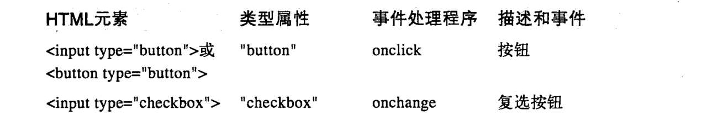
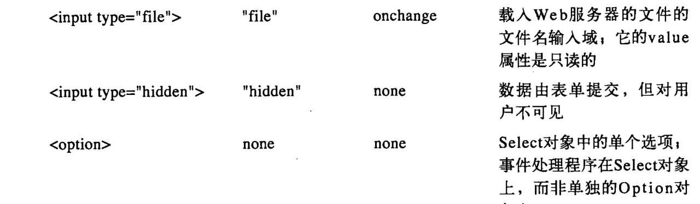
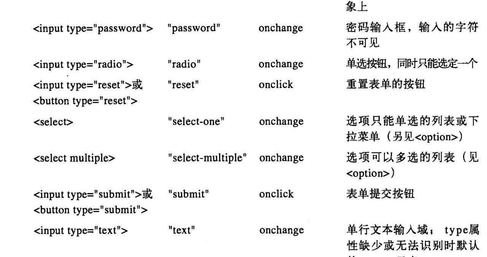

### 九、HTML表单 ###
HTML的`<form>`元素的诞生比JavaScript还要早，这一节我们学习的是脚本化HTML表单，不是HTML本身，HTML的表单元素有以下：

#### 1、选取表单和表单元素 ####
我们可以用`var fields = document.getElementById("address").getElementsByTagName("input"); `来获取表单元素。

在支持querySelectorAll()的浏览器中，从一个表单中选取所有的单选按钮或所有同名的元素的代码如下：

	//id为“shipiing”的表单中所有的单选按钮
	document.querySelectorAll('#shiping input[type="radio"]');
	//id为“shiping”的表单元素中所有名字为method的单选按钮
	document.querySelectorAll('#shiping input[type="radio"][name="method"]');
当然还有其他的方法，这里不再说。记住id属性比name属性在使用指定文档时更佳，不过name属性在表单中更具有普遍性。

注意：	
	var methods = document.forms.shiping.elements.method;
form元素本身有个HTML属性和对应的JS属性method，但是使用时必须用elements属性而非直接访问method属性。
	
	var shiping_method;
	for(var i = 0;i < methods.length;i++)
		if (methods[i].checked) shiping_method = methods[i].value;
#### 2、表单和v元素的属性 ####
上面的elements[]数组是个有意思的属性，下面对其他的属性的介绍：

**type**

标识表单元素类型的只读字符串。针对用`<input>`标签定义的表单元素，就是其type属性的值。其他表单元素是为了识别他们，如`<textarea>、<select>`就是这个样。

**form**

对包含元素的Form对象的只读引用，如果没有元素的话值为null。

**name**

只读的字符串，由HTML属性name指定。

**value**

可读/可写的字符串，指定了表单元素包含或代表的值。它是HTML的value属性来设置的一个字符串。
### 十、其他文档属性 ###
本章已经介绍了Document属性有body、documentElement和forms等这些特殊的文档元素。下面主要说说可编辑的内容这一部分。

如今所有的浏览器都支持简单的HTML编辑功能：我们看到的博客评论页，它就是嵌入了一个富文本编辑器，包含了设置排版样式（粗体、斜体）、对齐和插入图片与链接的工具。有两种方法来启用编辑功能：一是，设置任何标签的HTML contenteditable属性，二是设置对应元素的JavaScriptcontenteditable属性：
	
	

	Click to edit
	

可以为元素添加spellcheck属性来显示开启拼写检查，用spellcheck=false来显示关闭该功能。用Document对象的designMode属性设置为字符串“on”使得整个文档可编辑，设置为off则不可编辑。如下代码使得iframe变得可编辑。

	<iframe id="editor" src="about:blank"></iframe>//空的iframe
	
所有当今的浏览器都支持contenteditable和designMode属性，但在实际的可编辑行为时，它们是不太兼容的。大部分是没有快捷键盘的，为了执行这些命令，应该使用Document对象的execCommand()方法，用execCommand()执行的命令名字都是如“bold”、“subscript”、“justifycenter”或“insertimage”之类的字符串。命令名是execCommand()的第一参数。有些命令还需要一个值参数--例如，“createlink”需要一个超链接URL。理论上，如果execCommand()的第二个参数为true，浏览器会自动提示用户输入所需要的值。为了提高可移植性，应该提示用户输入，并传递false作为第二参数，传递用户输入的值作为第三参数。

	function bold() {document.execCommand("bold",false,url);}
	function link() {
		var url = prompt("Enter link destination");
		if(url) document.execCommand("createlink",false,url);}
execCommand()所支持的命令通常是由工具栏上的按钮触发的，当触发的命令不可用良好的UI会使对应的按钮不可用。可用document.queryCommandSupport()传递命令名来查询浏览器是否支持该命令。

一旦用户编辑了某元素的内容，该元素设置了contenteditable属性，就可以使用innerHTML属性得到已经编辑的HTML标记。

