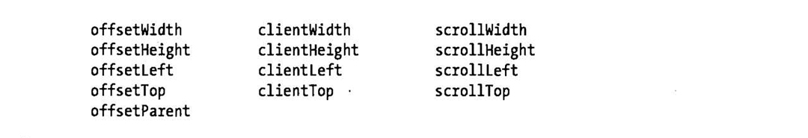

### 七、例子：生成目录表 ###
如何为文档动态创建一个目录表，它展示了上一节所描述的文档脚本化的诸多概念：元素选取、文档遍历、元素属性设置、innerHTML属性设置和在文档中创建与插入新节点。

for example 9：

	/**这个模块注册一个可在页面加载完成后自动运行的匿名函数。当执行这个函数时会去文档中查找id为“TOC”的元素。
	如果这个元素不存在，就创建一个元素。
	
	生成的TOC目录应当具有自己的CSS样式，整个目录区域的样式className设置为TOCEntry。<h1>标签生成的标题
	className为TOCLevel1，<h2>则为TOCLevel2，以此类推，段落的样式为TOCSectNum**/
	
	#TOC {border: 1px solid black; margin: 10px; padding: 10px;}
	.TOCEntry {font-family: sans-serif;}
	.TOCEntry a {text-decration: none;}
	.TOCLevel1 {font-size: 16pt;font-weight: bold;}
	.TOCLevel2 {font-size: 12pt;margin-left:.5in;}
	.TOCSecNum：after {content: ":";}<!--每个段落之后都有一个冒号和空格符，如果要隐藏则用--!>
	.TOCSecNum {display: none;}

	onLoad(function() {//匿名函数定义了一个局部作用域
		
		//查找TOC容器元素
		//如果不存在，则在文档开头创建一个

		var toc = document.getElementById("TOC");
		if (!toc) {
			toc = document.createElement("div");
			toc.id = "TOC";
			document.body.insertBefore(toc,document.body.firstChild);
		}
		
		//查找所有的标题元素

		var headings;
		if(document.querySelectorAll)//我们是否可以用这简单的方法
			heardings = document.querySelectorAll("h1,h2,h3,h4,h5,h6");
		else //否则。查找方法稍微麻烦一些
			headings = findHeadings(document.body,[]);

		//递归遍历document的body，查找标题元素
		function findHeadings(root,sects) {
			for(var c=root.firstChild;c != null;c = c.nextSibling) {
				if(c.nodeType !== 1) continue;
				if (c.tagName.length == 2 && c.tagName.chartAt(0) == "H") sects.push(c);
				else 
					findHeadings(c,sects);
			}
			return sects;
		}
		
		//初始化一个数组来保持跟踪章节号
		var sectionNumbers = [0,0,0,0,0,0];
		
		//现在，循环已经找到的标题元素
		for(var h=0;h < headings.length;h++) {
			var heading = headings[h];
			
			//跳过在TOC中的标题元素	
			if(heading.parentNode == toc) continue;

			//判定标题的级别
			var level = parseInt(heading.tagName.chartAt(1));
			if(isNaN(level) || level < 1 || level > 6) continue;

			//对于改标题级别增加sectionNumber对应的数字
			//重置所有标题比它级别低的数字为零
			sectionNumbers[level-1]++;
			for(var i = level;i < 6;i++) sectionNumbers[i] = 0;

			//现在，将所有标题级别的章节号组合产生一个章节号，如：1，2，3
			var sectionNumber = sectionNumbers.slice(0,level).join(".");
			
			//为标题级别增加章节号
			//把数字放在中，使得其可以用样式修饰
			var span = document.createElement("span");
			span.className = "TOCSecNum";
			span.innerHTML = sectionNumber;
			heading.insertBefore(span,heading.firstChild);
		
			//用命名的锚点将标题抱起来，以便为它增加链接
			var anchor = document.createElement("a");
			anchor.name = "TOC"+sectionNumber;
			heading.parentNode.insertBefore(anchor,heading);
			anchor.appendChild(heading);
			
			//现在为该节点创建一个链接
			var link = document.createElement("a");
			link.herf = "#TOC" + sectionNUmber;
			link.innerHTML = heading.innerHTML;

			//将链接放在一个div中，div用基于级别名字的样式修饰
			var entry = document.createElement("div");
			entry.className = "TOCEntry TOCLevel" + level;
			entry.appendChild(link);
			
			//该div添加到TOC容器中
			toc.appendChild(entry);
		}
	});
	
### 八、文档和元素的几何形状和滚动 ###
之前的章节中，文档看作是元素和文本节点的抽象树，是代码面的。但当浏览器在窗口中渲染时，这是文档的视觉层面，仍然有文档元素的位置和尺寸。怎样才能在抽象的基于树的文档模型与几何形状的基于坐标的视觉之间来回变换是我们这节的重点。
#### 1、文档坐标和视口坐标 ####
元素的位置使用像素来度量的，向右代表X坐标的增加，向下代表Y坐标的增加。但是有两个不同的原点作为坐标系的原点：元素的X和Y坐标可以相对于文档的左上角或相对于在显示文档的视口的左上角。在顶级窗口和标签页中，“视口”只是实际显示文档内容的浏览器的一部分：他不包括浏览器“外壳”（如菜单、工具条和标签页）。针对框架页中显示的文档，视口是定义了框架页的`<iframe>`元素。无论在何种情况下，当讨论元素的位置时，必须弄清楚所使用的坐标是文档坐标还是视口坐标（适口坐标也叫做窗口坐标）。	

如果文档坐标比视口坐标小或文档坐标未出现滚动情况，则文档坐标和适口坐标的原点是相同的。但，一般来说要在两种坐标系之间进行转换，必须加上或者减去滚动的偏移量（scroll offset）。例如，在文档坐标中如果一个元素的Y坐标是200px，并且用户已经把浏览器向下滚动75px，那么视口坐标中元素的Y坐标是125px。同样，在视口坐标中如果元素的X的坐标是400px，并且已经水平滚动了视口200px，那么文档坐标中元素的坐标是600像素。

对上面的解释是：一般情况下，视口是要小于文档的，视口是人们能看到的页面，一个页面的宽度和长度大于我们的浏览器的宽度和长度，所以有时我们必须滚动才能看到页面下或左右的信息。一个页面每个元素的位置在文档坐标中是固定的，而在视口坐标中则不同，因为有些我们不用滚动就能看到，滚动多少距离上面或右边有多远，这些都是不同的。加减则是正常的事情啦！至于怎么获得文档元素的位置坐标和视口坐标中元素的位置以及滚动向下和向右的位置，这些都是我们接下来的事情。

为了获得浏览器窗口的滚动条的位置。Window对象的pageXoffset和pageYoffset属性在所有的浏览器中提供这些值，除了IE8以及更早的浏览器。IE及其他浏览器也可以用scrollLeft和scrollTop属性来获得滚动条的位置。不过迷惑的事情总是会有的，正常情况下通过查询文档的根节点（document.documentElement）来获取这些属性值，但在怪异模式下，必须在文档的`<body>`元素（document.body）来查询他们。例如显示如何简便查询滚动条的位置。

for example 10：

	//查询滚动条的位置
	//以一个对象的x和y属性的方式返回滚动条的偏移量
	function getScrollOffsets(w) {
		//使用制定的窗口，如果不带参数则使用当前窗口
		w = w || window;
		//除了IE8及更早的版本外，其他浏览器都能使用
		if (w.pageXoffset != null) return { x: w.pageXoffset,y: w.pageYoffset};
		
		//标准模式下
		var d = w.document;
		if(document.compatMode == "CSS1Compat")
			return {x: d.documentElement.scrollLeft,y: d.documentElement.scrollTop};
		
		//怪异模式下的浏览器
			return {x: d.body.scrollLeft,y: d.body.scrollTop};
		}
接下来判定视口尺寸，这里也是分怪异模式和标准模式

for example 11：
	
	//查询视口的视口尺寸
	//作为一个对象的w和h属性返回视口的尺寸
	function getViewportSize(w) {
		//使用指定的窗口，如果不带参数则使用当前的窗口
		w = w || window;
	
		//除了IE8及更早的版本外，其他浏览器都能用
		if(w.innerWidth != null)  return { w: w.innerWidth,h: w.innerHeight};
	
		//标准模式下的IE（或任何浏览器）
		var d = w.document;
		if (document.compatMode == "CSS1Compat") 
			return { w: d.documentElement.clientWidth,
					 h: d.documentElement.clientHeight};
	
		//怪异模式下的浏览器
		return {w: d.body.clientWidth,h:d.body.clientWidth};
	}
下面就是clientWidth和clientHeight及scrollLeft和scrollTop的介绍了
#### 2、查询元素的几何尺寸 ####
判定一个元素的尺寸和位置最简单的方法是调用它的getBoundingClientRect()方法，不需要参数，返回一个有left、right、top和bottom属性的对象。left和top属性表示元素的左上角的X和Y坐标，right和bottom表示元素的右下角的X和Y坐标。

这个方法返回元素在视口坐标中的位置。getBoundingClientRect()中的Client是一种间接指代，专指向它定义的窗口或视口。为了转化为甚至用户滚动浏览器以后仍然有效的文档坐标，需要加上偏移量：

	var box = e.getBoundingClientRect();//获得在视口坐标中的位置
	var offsets = getScrollOffsets();//例子10已经定义的工具函数
	var x = box.left + offsets.x;//转化为文档坐标
	var y = box.top + offsets.y;
在很多浏览器中这个方法返回的对象还包含width和height属性，但在原始的IE中并未实现，这样的话计算元素的width和height：

	var box = e.getBoundingClientRect();
	var w = box.width || (box.right - box.left);
	var h = box.height || (box.bottom - box.top);
注意此方法不包含元素的外边距。如果想查询内联元素的独立的矩形，用getClientRects()来获取一个只读属性既可，这个类似于getBoundingClientRect()返回的矩形对象。这个返回的不是实时的，他们仅仅立足于调用方法时，文档的视觉状态的静态快照用户滚动或改变浏览器窗口的大小时不会更新他们。
#### 3、判定元素在某点 ####
这个是鼠标事件在target属性包含的信息，再说。
#### 4、滚动 ####
获得浏览器滚动条的位置，可以用scrollLeft属性和scrollTop属性，但有一种更简单的方法，就是Window对象的scrollTop()方法（其同义词scroll()）接受一个点的X和Y坐标，作为滚动条的偏移量设置它们。也就是，窗口滚动到指定的点出现在视口的左上角。

	//获得文档和视口的高度，offsetHeight会在下面解释
	var documentHeight = document.documentElement.offsetHeight;
	var viewportHeight = window.innerHeight;//或使用上面的getViewportSize
	//然后，滚动到最后一页在视口中可见
	window.scrollTo(0,documentHeight - viewportHeight);

Window的scrollBy()方法和scroll()和scrollTo()类似，但他们的参数是相对的，并在当前滚动条的偏移量上增加。例如，

	//每200毫秒向下滚动10px，这个是无法关闭的
	javascript:void setInterval(function() {scrollBy(0,10)},200);
#### 5、关于元素尺寸、位置和溢出的更多信息 ####
getBoundingClientRect()方法应用广泛，但不能仅靠这个方法来判定元素的尺寸和位置，元素的尺寸比较简单：任何HTML元素的只读属性offsetWidth和offsetHeight以CSS像素返回他的屏幕尺寸，返回的尺寸出去了外边距。

所有HTML元素拥有offsetLeft和offsetTop属性来返回元素的X和Y坐标，对于很多元素，这些值是文档坐标，并直接指定元素的位置。

clientWidth和clientHeight类似于offsetWidth和offsetHeight，不同的是前者不包含内容和内边距，对于内联元素，前者（client开头的均是如此）也是返回0。