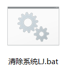

我是不愿意在自己的电脑上装个电脑管家、360卫士或者金山毒霸什么玩意的东西来清理我的电脑的，前两天在网上浏览到一个好玩的东西，你只要设置一下，花你几分钟的时间就能自己搞个清理器，不要钱还没有绑定的插件，效果还不错！
这个家伙长什么样子呢？

**如图：**

#### 注意事项： ####
1.这个样子你直接点击就能进行清理工作了；

2.这个文件的格式是.bat，这是必须改成这个样子；

3.编辑的时候把如下代码粘贴进text文档就行了：

	@echo off     
	echo 正在清除系统垃圾文件，请稍等......     
	del /f /s /q %systemdrive%\*.tmp     
	del /f /s /q %systemdrive%\*._mp     
	del /f /s /q %systemdrive%\*.log     
	del /f /s /q %systemdrive%\*.gid     
	del /f /s /q %systemdrive%\*.chk     
	del /f /s /q %systemdrive%\*.old     
	del /f /s /q %systemdrive%\recycled\*.*     
	del /f /s /q %windir%\*.bak     
	del /f /s /q %windir%\prefetch\*.*     
	rd /s /q %windir%\temp & md %windir%\temp     
	del /f /q %userprofile%\COOKIES s\*.*     
	del /f /q %userprofile%\recent\*.*     
	del /f /s /q "%userprofile%\Local Settings\Temporary Internet Files\*.*"     
	del /f /s /q "%userprofile%\Local Settings\Temp\*.*"     
	del /f /s /q "%userprofile%\recent\*.*"     
	sfc /purgecache '清理系统盘无用文件     
	defrag %systemdrive% -b '优化预读信息     
	echo 清除系统LJ完成！     
	echo. & pause  

把上面的粘到txt文档后，修改改为.bat就能用了。